# AI-Credit-Card-Fraud
_Built with_


[](https://github.com/emilk/egui)
[](https://github.com/rust-secure-code/safety-dance/)

[](https://github.com/emilk/egui/blob/master/LICENSE-MIT)

## Simulation software using trained model


### Required dependencies

sudo pacman -Syu libclang-dev libgtk-3-dev libxcb-render0-dev libxcb-shape0-dev libxcb-xfixes0-dev libxkbcommon-dev libssl-dev

### How to run

create a .env file like this.

MODEL_PATH=path/to/model/folder/

The model must be named lgb.txt if lightgbm and model.onnx if onnx
```dotenv
MODEL_PATH=python/model/
RUST_LOG=warn
```

#### ONNX
```bash
cargo run --release
```

#### LightGBM
```bash
cargo run --release --features lightgbm
```

## Training

### Where to find the dataset

The dataset can be found at https://www.kaggle.com/datasets/mlg-ulb/creditcardfraud
and should be downloaded and put inside the /python/dataset/ folder naming the file "data.arff"

### How to train
Setup environmental variables to have granular control over the training process.
For the first run it's recommended to keep everything enabled

After that run the main.py file.

### Results

#### Overview


#### In depth

##### Confusion Matrices

<table width="100%">
  <tr>
    <td width="50%">Decision Tree Confusion Matrix</td>
    <td width="50%">Random Forest Confusion Matrix</td>
  </tr>
  <tr>
    <td width="50%"></td>
    <td width="50%"></td>
  </tr>
  <tr>
    <td width="50%">Logistic Regression Confusion Matrix</td>
    <td width="50%">LightGBM Confusion Matrix</td>
  </tr>
  <tr>
    <td width="50%"></td>
    <td width="50%">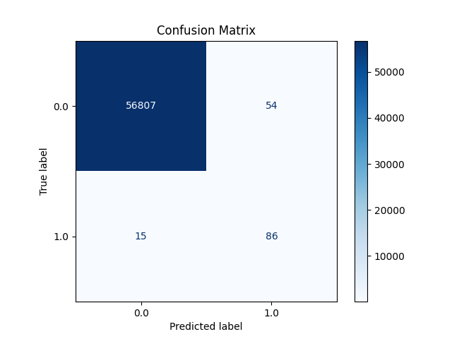</td>
  </tr>
  <tr>
    <td width="50%">AdaBoost Confusion Matrix</td>
    <td width="50%">CatBoost Confusion Matrix</td>
  </tr>
  <tr>
    <td width="50%"></td>
    <td width="50%"></td>
  </tr>
  <tr>
    <td width="50%">XGBoost Confusion Matrix</td>
    <td width="50%">TabNet Confusion Matrix</td>
  </tr>
  <tr>
    <td width="50%"></td>
    <td width="50%">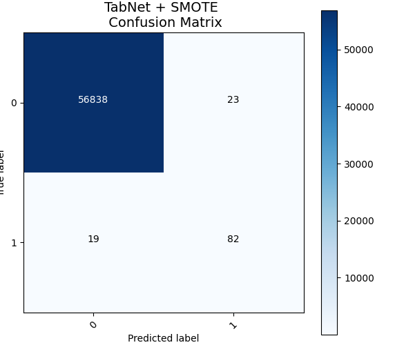</td>
  </tr>
</table>

##### Roc Curves

<table width="100%">
  <tr>
    <td width="50%">Decision Tree Roc Curve</td>
    <td width="50%">Random Forest Roc Curve</td>
  </tr>
  <tr>
    <td width="50%">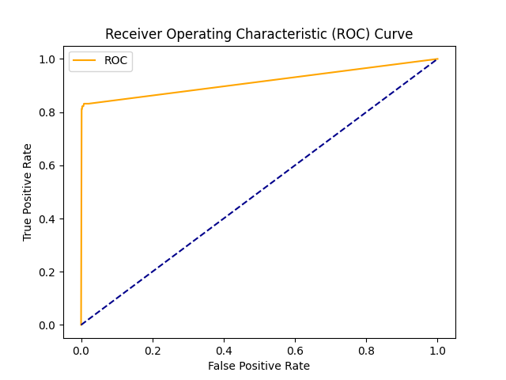</td>
    <td width="50%">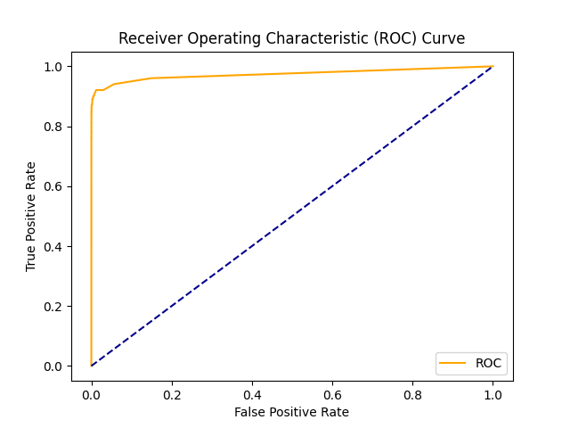</td>
  </tr>
  <tr>
    <td width="50%">Logistic Regression Roc Curve</td>
    <td width="50%">LightGBM Roc Curve</td>
  </tr>
  <tr>
    <td width="50%"></td>
    <td width="50%">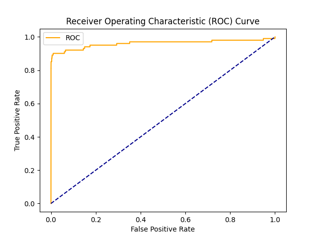</td>
  </tr>
  <tr>
    <td width="50%">AdaBoost Roc Curve</td>
    <td width="50%">CatBoost Roc Curve</td>
  </tr>
  <tr>
    <td width="50%">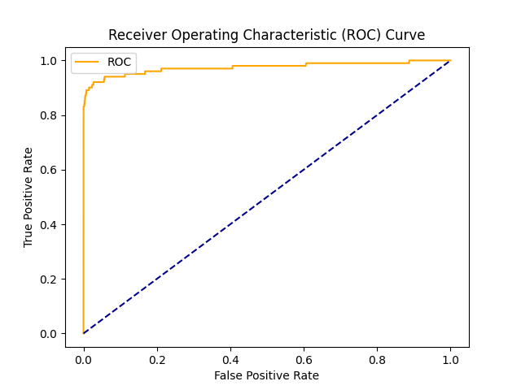</td>
    <td width="50%">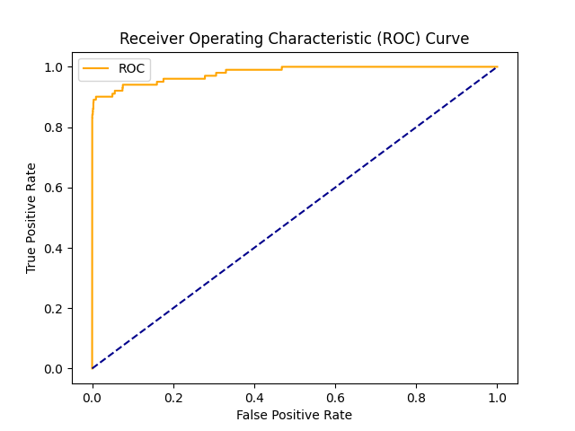</td>
  </tr>
  <tr>
    <td width="50%">XGBoost Roc Curve</td>
    <td width="50%">TabNet Roc Curve</td>
  </tr>
  <tr>
    <td width="50%">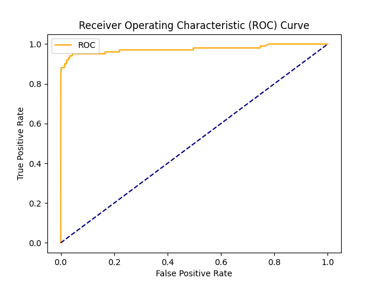</td>
    <td width="50%">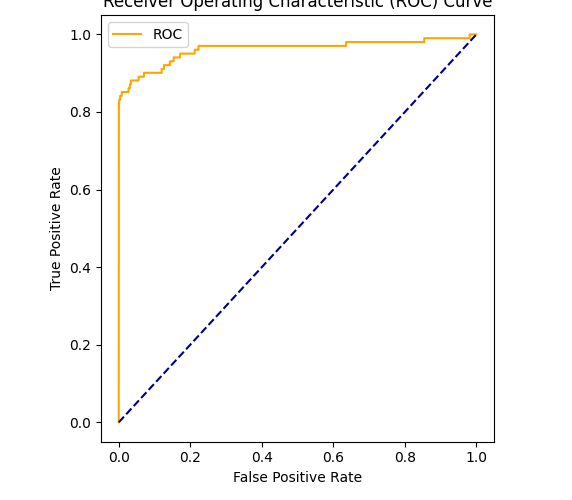</td>
  </tr>
</table>

##### Spider Charts

<table width="100%">
  <tr>
    <td width="50%">Decision Tree Spider Chart</td>
    <td width="50%">Random Forest Spider Chart</td>
  </tr>
  <tr>
    <td width="50%">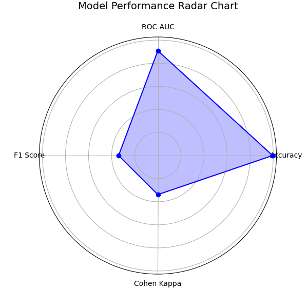</td>
    <td width="50%">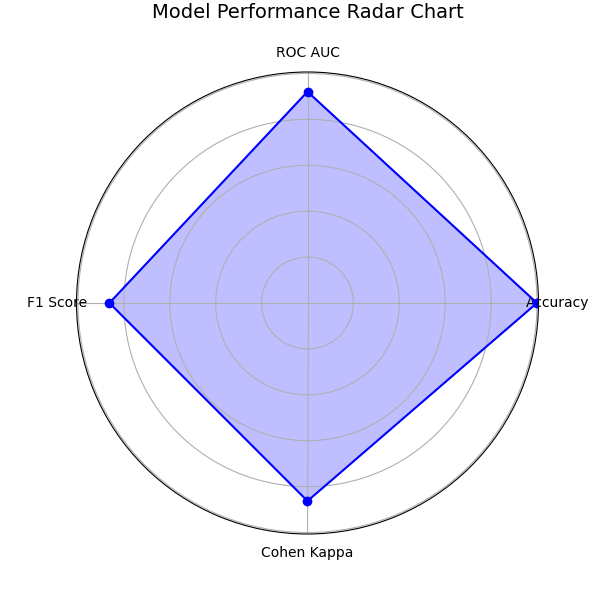</td>
  </tr>
  <tr>
    <td width="50%">Logistic Regression Spider Chart</td>
    <td width="50%">LightGBM Spider Chart</td>
  </tr>
  <tr>
    <td width="50%">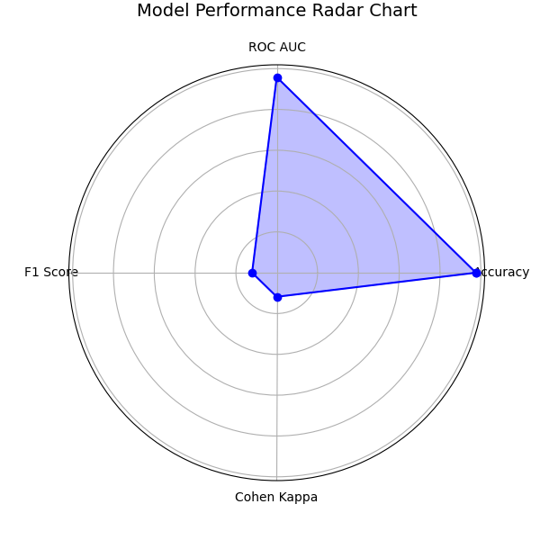</td>
    <td width="50%">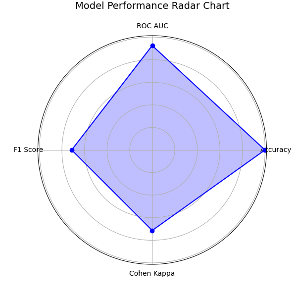</td>
  </tr>
  <tr>
    <td width="50%">AdaBoost Spider Chart</td>
    <td width="50%">CatBoost Spider Chart</td>
  </tr>
  <tr>
    <td width="50%"></td>
    <td width="50%">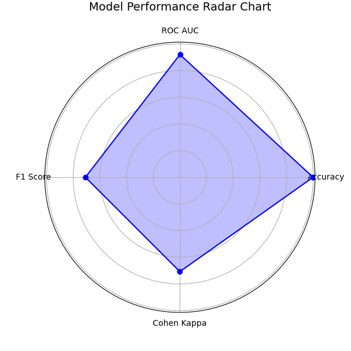</td>
  </tr>
  <tr>
    <td width="50%">XGBoost Spider Chart</td>
    <td width="50%">TabNet Spider Chart</td>
  </tr>
  <tr>
    <td width="50%">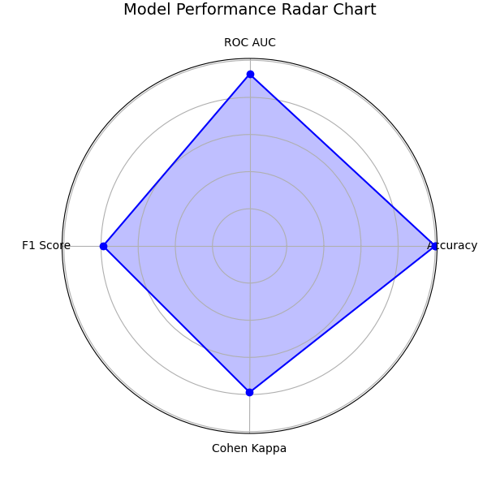</td>
    <td width="50%">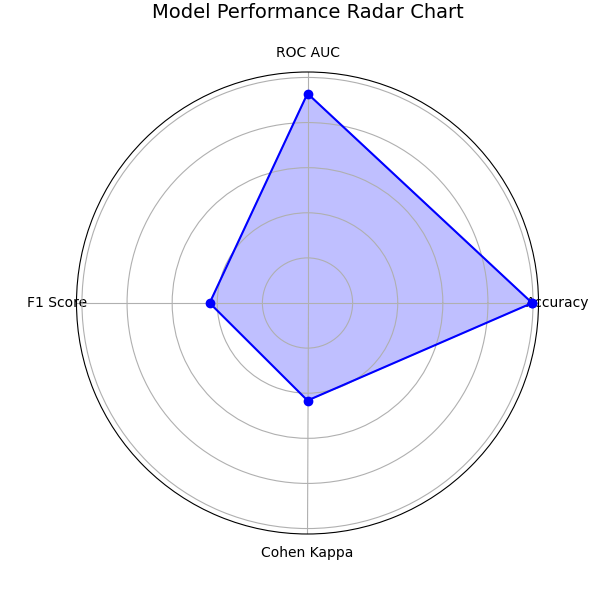</td>
  </tr>
</table>

##### Model F1 Score and Time

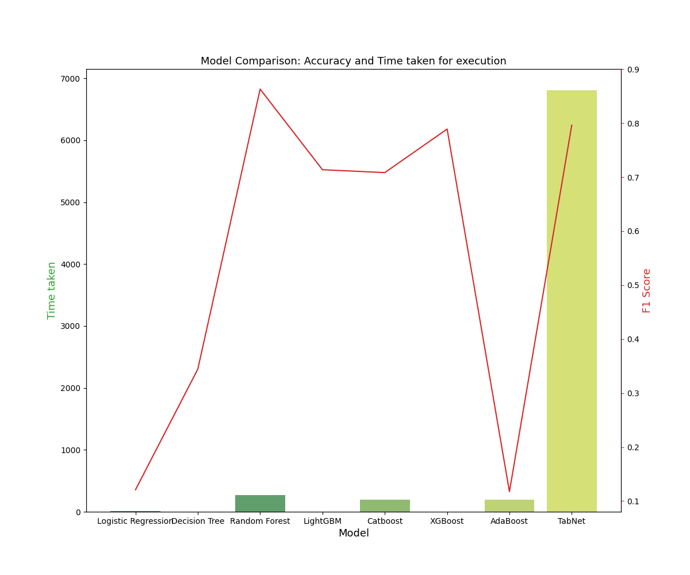

Random Forest, XGBoost and TabNet are the best w.r.t. all the parameters we've chosen.
* Random Forest: Best F1 score but slow
* TabNet: Good F1 score, slowest (even using GPU)
* XGBoost: Good F1 score, fastest

We will choose XGBoost to have a good trade-off between time and F1 score.

## Acknowledgments
### Code

* Design by *__Meru__*
* Code by me (*__RakuJa__*)

### Dataset

The dataset has been collected and analysed during a research collaboration of Worldline and the Machine Learning Group (http://mlg.ulb.ac.be) of ULB (Université Libre de Bruxelles) on big data mining and fraud detection.
More details on current and past projects on related topics are available on https://www.researchgate.net/project/Fraud-detection-5 and the page of the [DefeatFraud](https://mlg.ulb.ac.be/wordpress/portfolio_page/defeatfraud-assessment-and-validation-of-deep-feature-engineering-and-learning-solutions-for-fraud-detection/) project

Please cite the following works:

Andrea Dal Pozzolo, Olivier Caelen, Reid A. Johnson and Gianluca Bontempi. [Calibrating Probability with Undersampling for Unbalanced Classification.](https://www.researchgate.net/publication/283349138_Calibrating_Probability_with_Undersampling_for_Unbalanced_Classification) In Symposium on Computational Intelligence and Data Mining (CIDM), IEEE, 2015

Dal Pozzolo, Andrea; Caelen, Olivier; Le Borgne, Yann-Ael; Waterschoot, Serge; Bontempi, Gianluca. [Learned lessons in credit card fraud detection from a practitioner perspective,](https://www.researchgate.net/publication/260837261_Learned_lessons_in_credit_card_fraud_detection_from_a_practitioner_perspective) Expert systems with applications,41,10,4915-4928,2014, Pergamon

Dal Pozzolo, Andrea; Boracchi, Giacomo; Caelen, Olivier; Alippi, Cesare; Bontempi, Gianluca. [Credit card fraud detection: a realistic modeling and a novel learning strategy,](https://www.researchgate.net/publication/260837261_Learned_lessons_in_credit_card_fraud_detection_from_a_practitioner_perspective) IEEE transactions on neural networks and learning systems,29,8,3784-3797,2018,IEEE

Dal Pozzolo, Andrea [Adaptive Machine learning for credit card fraud detection](http://di.ulb.ac.be/map/adalpozz/pdf/Dalpozzolo2015PhD.pdf) ULB MLG PhD thesis (supervised by G. Bontempi)

Carcillo, Fabrizio; Dal Pozzolo, Andrea; Le Borgne, Yann-Aël; Caelen, Olivier; Mazzer, Yannis; Bontempi, Gianluca. [Scarff: a scalable framework for streaming credit card fraud detection with Spark,](https://www.researchgate.net/publication/319616537_SCARFF_a_Scalable_Framework_for_Streaming_Credit_Card_Fraud_Detection_with_Spark) Information fusion,41, 182-194,2018,Elsevier

Carcillo, Fabrizio; Le Borgne, Yann-Aël; Caelen, Olivier; Bontempi, Gianluca. [Streaming active learning strategies for real-life credit card fraud detection: assessment and visualization,](https://www.researchgate.net/publication/332180999_Deep-Learning_Domain_Adaptation_Techniques_for_Credit_Cards_Fraud_Detection) International Journal of Data Science and Analytics, 5,4,285-300,2018,Springer International Publishing

Bertrand Lebichot, Yann-Aël Le Borgne, Liyun He, Frederic Oblé, Gianluca Bontempi [Deep-Learning Domain Adaptation Techniques for Credit Cards Fraud Detection,](https://www.researchgate.net/publication/332180999_Deep-Learning_Domain_Adaptation_Techniques_for_Credit_Cards_Fraud_Detection) INNSBDDL 2019: Recent Advances in Big Data and Deep Learning, pp 78-88, 2019

Fabrizio Carcillo, Yann-Aël Le Borgne, Olivier Caelen, Frederic Oblé, Gianluca Bontempi [Combining Unsupervised and Supervised Learning in Credit Card Fraud Detection](https://www.researchgate.net/publication/333143698_Combining_Unsupervised_and_Supervised_Learning_in_Credit_Card_Fraud_Detection) Information Sciences, 2019

Yann-Aël Le Borgne, Gianluca Bontempi [Reproducible machine Learning for Credit Card Fraud Detection - Practical Handbook](https://www.researchgate.net/publication/351283764_Machine_Learning_for_Credit_Card_Fraud_Detection_-_Practical_Handbook)

Bertrand Lebichot, Gianmarco Paldino, Wissam Siblini, Liyun He, Frederic Oblé, Gianluca Bontempi [Incremental learning strategies for credit cards fraud detection,](https://www.researchgate.net/publication/352275169_Incremental_learning_strategies_for_credit_cards_fraud_detection) IInternational Journal of Data Science and Analytics