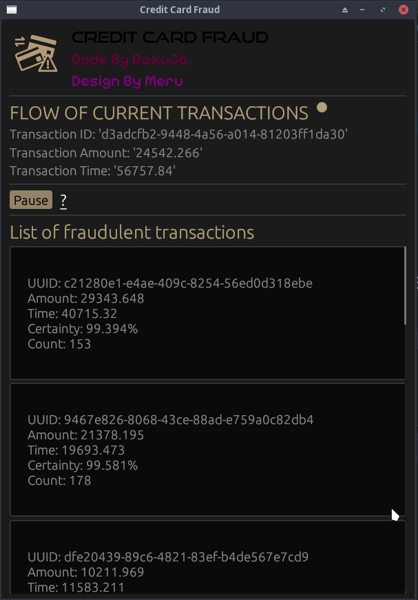

# AI-Credit-Card-Fraud
_Built with_


[](https://github.com/emilk/egui)
[](https://github.com/rust-secure-code/safety-dance/)

[](https://github.com/emilk/egui/blob/master/LICENSE-MIT)

## Training

### Where to find the dataset

The dataset can be found at https://www.kaggle.com/datasets/mlg-ulb/creditcardfraud
and should be downloaded and put inside the /python/dataset/ folder naming the file "data.arff"

### How to train
Setup environmental variables to have granular control over the training process.
For the first run it's recommended to keep everything enabled

After that run the main.py file.

### Results


## Simulation software using trained model



Ferris is a placeholder that should be swapped later on.

### Required dependencies

sudo pacman -Syu libclang-dev libgtk-3-dev libxcb-render0-dev libxcb-shape0-dev libxcb-xfixes0-dev libxkbcommon-dev libssl-dev

### Run it
```bash
cargo run --release
```